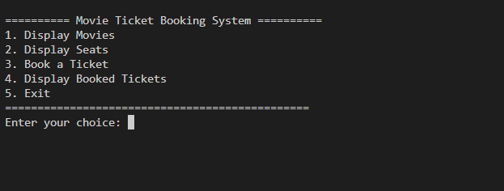
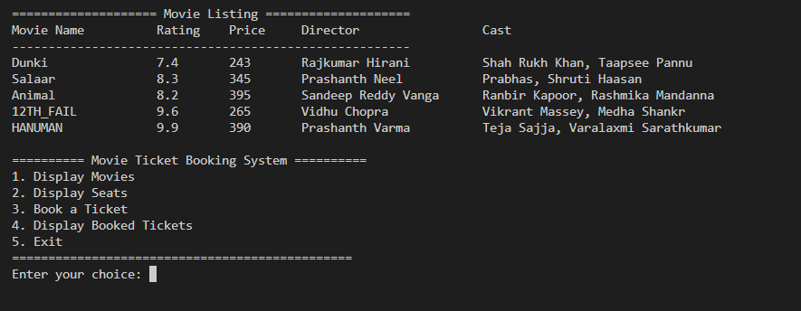
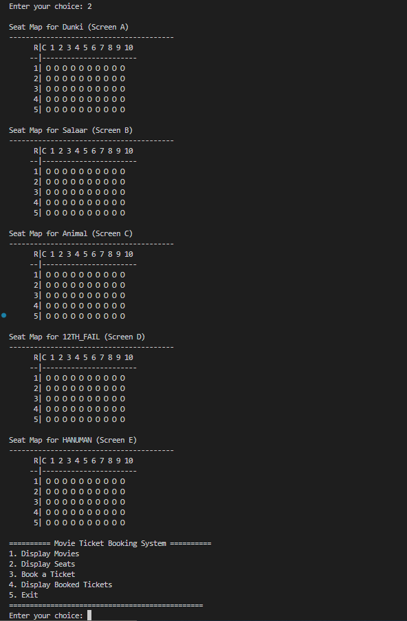
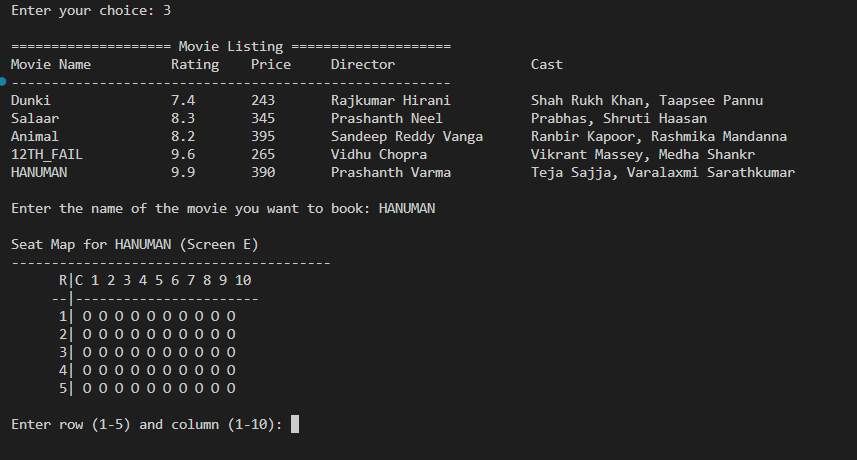
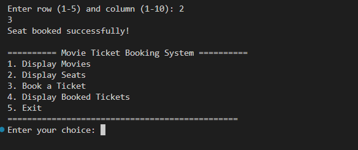
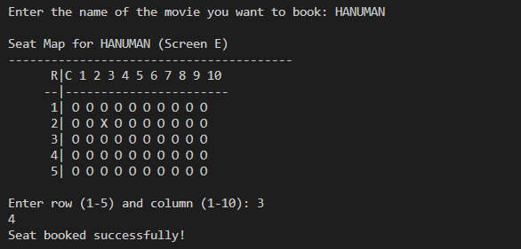
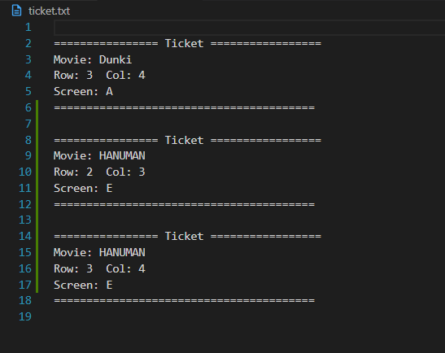

🎬 Movie Ticket Booking System
---

📖 **Introduction**
---
This is a simple Movie Ticket Booking System implemented in C++. It allows users to browse movies, check available seats, and book tickets interactively. Booked tickets are stored in a text file (`ticket.txt`) for record-keeping.

✨ **Features**
---
- 🎥 Movie Listings with name, rating, price, director, and cast.  
- 🪑 Seat Map Display showing available (O) and booked (X) seats.  
- 🎟️ Ticket Booking with row/column seat selection.  
- 📂 Persistent Storage of tickets in a text file.  
- 📊 Track Available Seats dynamically.  
- 📋 View All Booked Tickets in a formatted way.  

🛠 **Tech Stack**
---
- **Programming Language:** C++  
- **File Handling:** Used for saving ticket details in `ticket.txt`  

📂 **Data Structures Used**
---
- `struct` → For Movie, Casting, and Ticket objects.  
- `vector` → To store movie details and booked tickets dynamically.  
- `int seats[5][ROWS][COLS]` → For managing seat booking status across screens.  

🌟 **Uniqueness**
---
- Supports multiple screens with separate seat maps.  
- Stores cast and director info along with movie details.  
- Seats are visualized like a real theater layout.  
- Data is saved to a file, ensuring ticket history persistence.  

📚 **Learning Outcomes**
---
- Improved knowledge of OOP concepts in C++.  
- Hands-on practice with vectors, arrays, and structs.  
- File handling in C++ for saving and retrieving booking info.  
- Building a menu-driven console application with real-life use case.  

🎥 **Demo & Flow**
---
1. Run the program → Menu will be displayed.  
  
2. Choose an option:  
   - **Display Movies** → Shows movie list with details.  
  
   - **Display Seats** → View seat maps of all movies.  
  
   - **Book a Ticket** → Select movie → Pick a seat → Ticket gets booked.
       
   - **Display Booked Tickets** → View all past bookings.   
  
   - **Exit** → Close program.  

Tickets are automatically saved in `ticket.txt`.  

